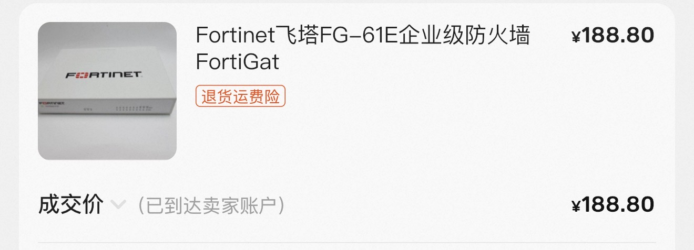
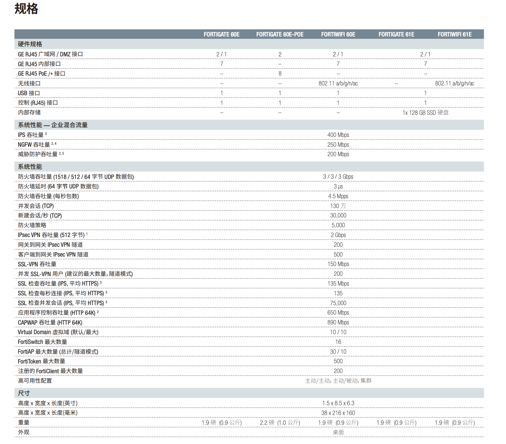
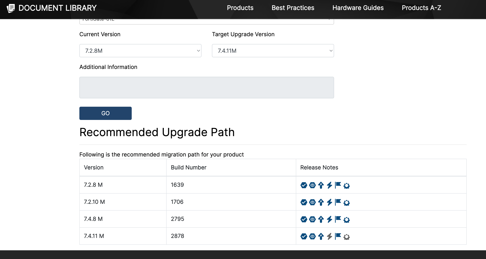
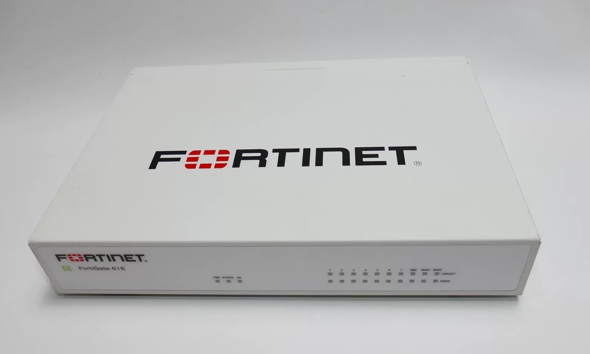
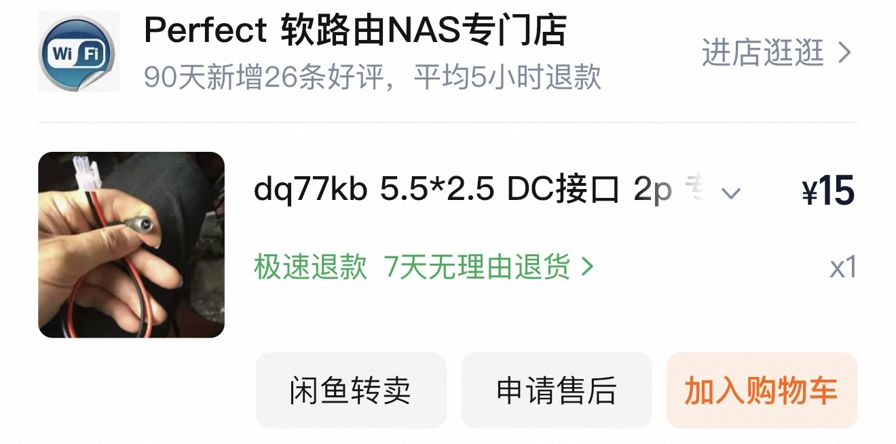
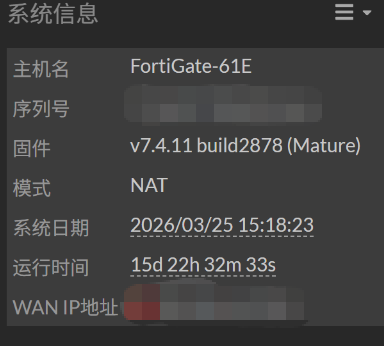

家里之前一直用的TPLink家的路由器，想拿tailscale连回老家的nas，发现了TPLink最坑的点，他对IPv6的防火墙支持**仅有全开/全关**两个选择

ASUS路由器的IPv6防火墙支持的很好，但很贵，偶然发现二手的企业级设备非常之便宜，闲鱼188购买了一台不能退出注册的二手飞塔FG61E



防火墙本身的那些IPS、AC功能是不能用了，但作为一个基础的防火墙，其性能极佳，CPU是飞塔定制的SOC3，四核心ARM配合2GB的RAM，PPPoE可以跑满我家300M宽带，支持130W的并发，性能不弱于TP-LINK新款企业路由 TL-ER3228ET（价格1000左右但并发只有15W），唯一的缺点就是仅有的7个LAN口和2个WAN口都是1G的，现在的新机器都是10G或者2.5G的



众所周知，企业级的东西，没有订阅是没办法下载最新固件的，但好在飞塔FortiNet是一家美国公司，我们可以从这个[伊朗的神奇网站](https://dl.partian.co/)下载他们的全部固件（注：2026年3月，伊朗在打仗，网站限制只能通过伊朗的IP访问）

FG61E目前的稳定版本固件有三个

- 7.4.11

  注意7.4.x版本之后，不再像之前版本一样可以随意刷机，没有订阅只能在7.4.x小版本里刷机，不能再降级

- 7.2.13

  最后一个随意互刷的版本，相比7.4缺少了ZTNA零信任组网的功能，没有订阅用起来没差

- 7.0.12

  没用过，不做评价

企业级防火墙的升级需要遵循依赖关系，这个[飞塔网站](https://docs.fortinet.com/upgrade-tool/fortigate)可以展示升级路径，按路径升级不会出问题



升级好了之后配置，记得用CLI，Web前端的v6是不全的，配上也没法用

以北京移动宽带为例，IPv6相关wan配置如下

```yaml
config system interface
    edit "wan1"
        set vdom "root"
        set mode pppoe
        set type physical
        set tcp-mss 1432
        set alias "宽带"
        set lldp-reception disable
        set role wan
        set snmp-index 1
        config ipv6
            set ip6-mode pppoe
            set ip6-allowaccess ping
            set dhcp6-prefix-delegation enable
            set autoconf enable
            config dhcp6-iapd-list
                edit 5
                next
            end
        end
        set username "biubiubiu"
        set password ENC dadadadadadada
        set dns-server-override disable
```

IPv6相关LAN配置如下

```yaml
config system interface
    edit "internal"
        set vdom "root"
        set ip 192.168.66.66 255.255.255.0
        set allowaccess ping https ssh http
        set type hard-switch
        set stp enable
        set lldp-reception disable
        set lldp-transmission disable
        set role lan
        set snmp-index 15
        config ipv6
            set ip6-mode delegated
            set ip6-send-adv enable
            set ip6-other-flag enable
            set ip6-link-mtu 1400
            set ip6-delegated-prefix-iaid 5
            set ip6-upstream-interface "wan1"
            set ip6-subnet ::1/64
            config ip6-delegated-prefix-list
                edit 1
                    set upstream-interface "wan1"
                    set delegated-prefix-iaid 5
                    set subnet ::/64
                next
            end
        end
```

- mtu要设置小一点，v4的MTU因为用了PPPoE是1492，v6的开销更大，设置1492会导致v6连不上
- 注意WAN的v6连接上游是PPPoE，但依旧要开启DHCPv6给下游的LAN分配v6的DNS

小防火墙还是挺精致的，无风扇，安静运行，电源接口很奇怪，我是买的转接线（15元）配合我之前的12v5a的DC口2.5*5.5电源





企业级的东西不用重启，实测比特彗星下东西，带宽占满，并发3W，CPU占用只有20%，这个价格下非常满意了



61E已经停止更新了，同代的还有30E 50E和60E，60E比这个61E少了128G的硬盘，日志只能存在内存或者Log服务器里，30E 50E没有硬件加速，性能差挺多，这俩不建议购买
